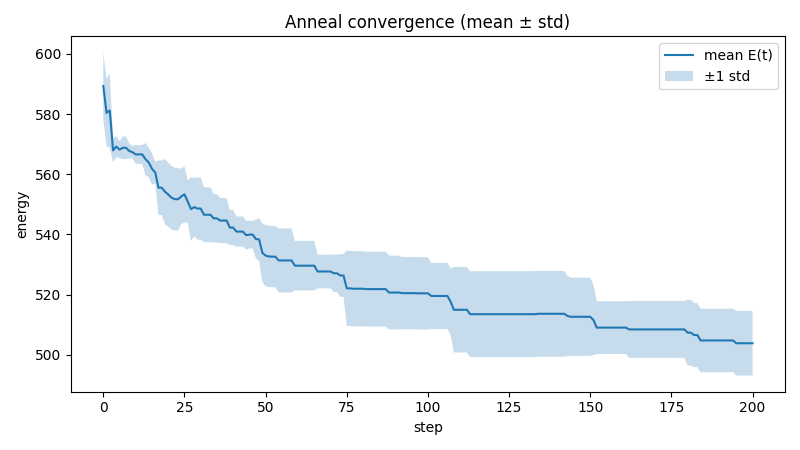

# Livnium Engine

Livnium Engine is a reversible lattice intelligence substrate exploring whether stable, intelligence-like behavior can emerge from conserved geometry and local dynamics.

## What it is
- Deterministic **N×N×N** lattice of coordinates (odd N ≥ 3)
- State is a permutation of tokens over lattice coordinates
- **Global cube rotations** (24 proper rotations)
- **Local reversible rotations** on bounded sub-cubes
- Energy functions + an annealing explorer for **attractor / basin discovery**

## Architecture overview
- Phase-1: Global symmetry engine (24 proper cube rotations)
- Phase-2: Local reversible operations (`apply_local`)
- Phase-3: Energy-guided dynamics (`explore_anneal_local`) + plots/reports

## Quick start
From repo root:

```bash
python3 -m pytest
python3 scripts/explore_local_demo.py
python3 scripts/phase3_report.py
```

Artifacts from the Phase-3 report are written under `artifacts/phase3/` by default.
A small example output snapshot is tracked in `results/phase3_test_run/`.

## Results snapshot (Phase-3)



## Repository notes
- Python package import name: `livnium_engine`
- Primary core class: `LivniumEngineCore`
- Back-compat alias: `AxionGridCore`
- License: research-only (see `LICENSE`). Commercial use requires permission.

## Relation to Nova Memory
Nova Memory applies related principles to auditable AI memory systems. Livnium Engine is the experimental substrate layer.
